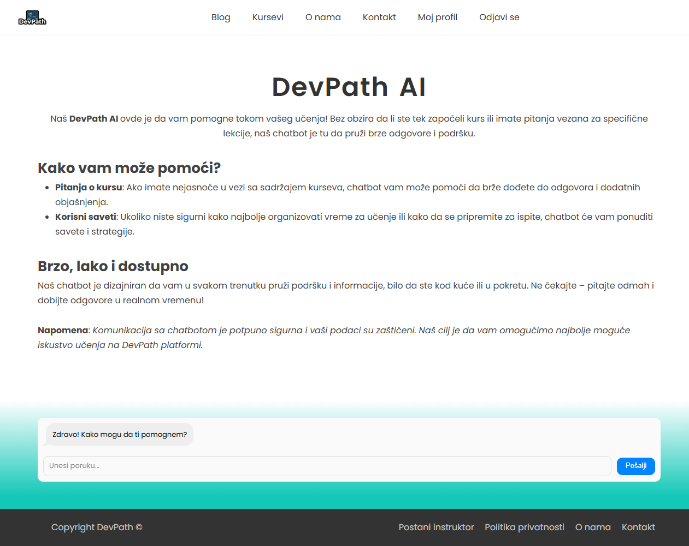
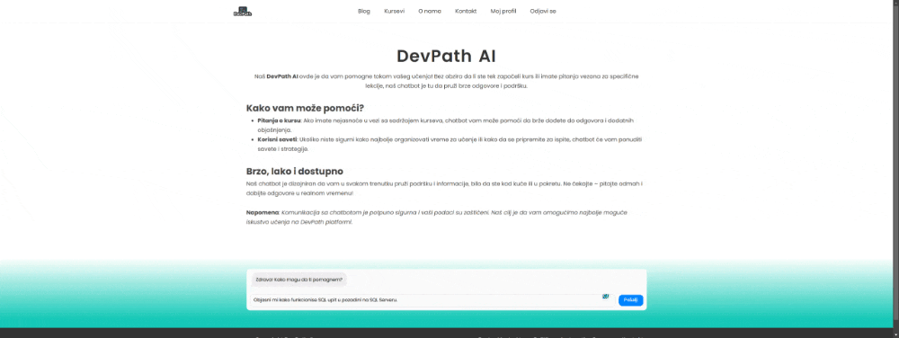
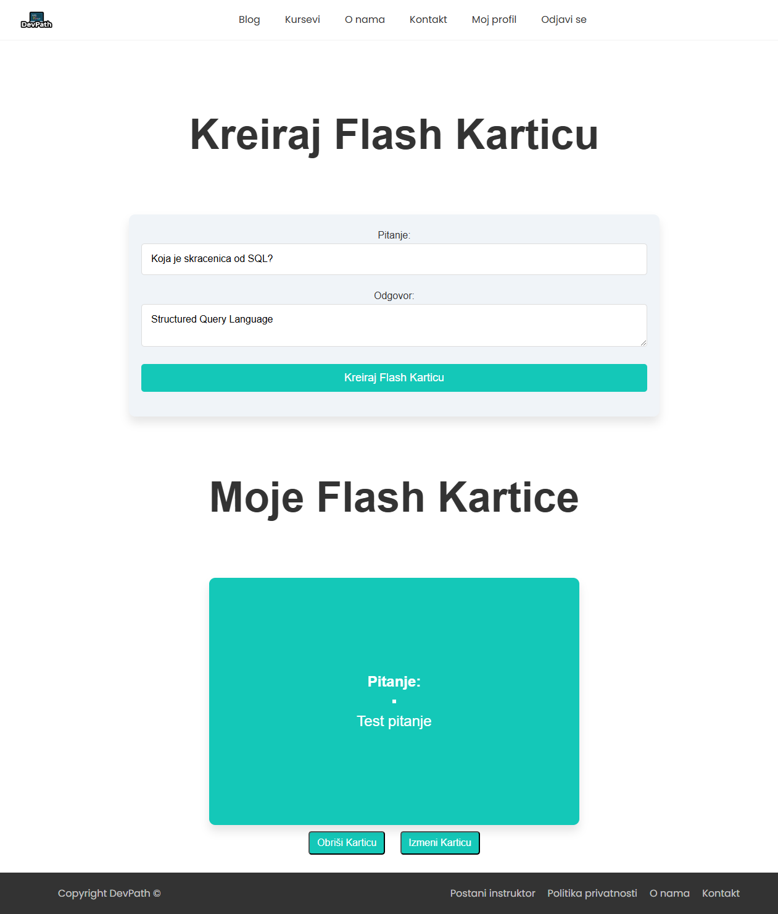
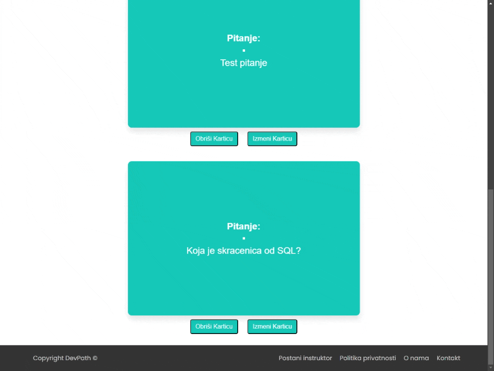
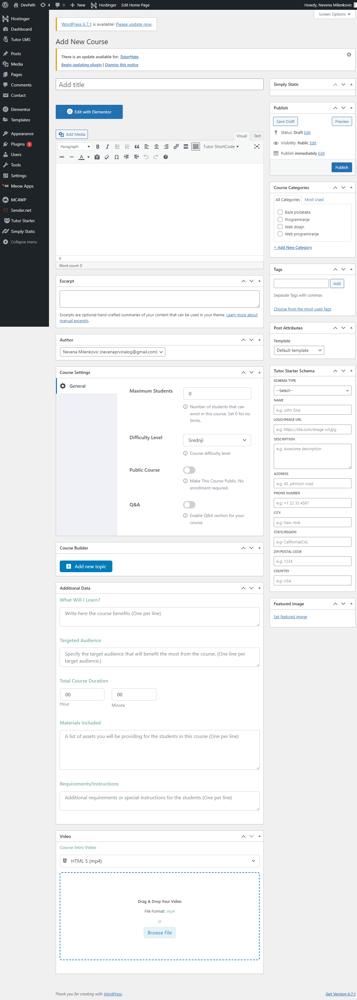
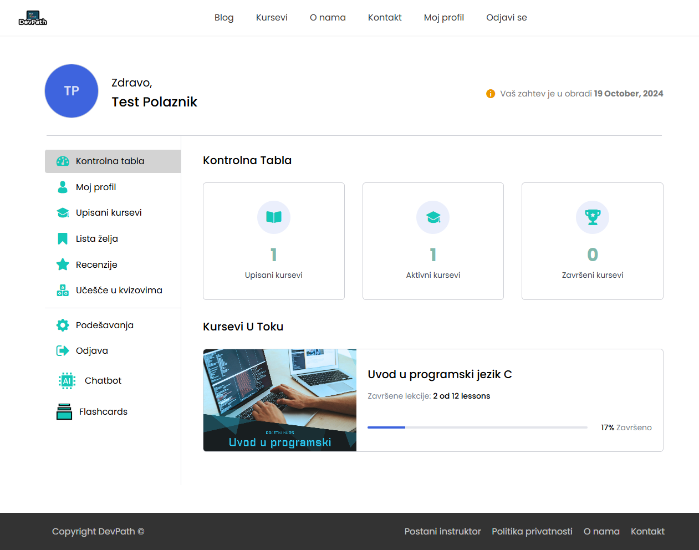
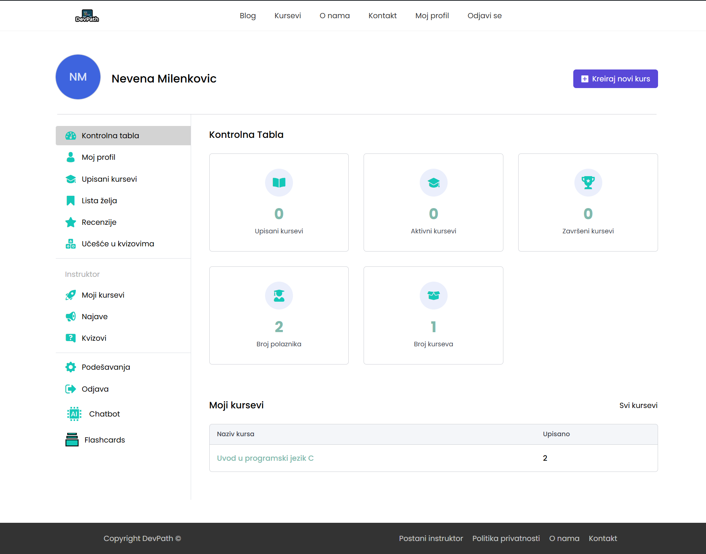

# DevPath LMS

DevPath je Learning Management System platforma, razvijena s ciljem da unapredi proces online obrazovanja kroz personalizaciju, fleksibilnost i interaktivnost. Platforma kombinuje tehnologiju i praktične alate kao što su AI asistent i alat za izradu flash kartica kako bi korisnicima pružila efikasno i organizovano iskustvo učenja.

---

## Statička verzija
Statički prikaz platforme, dostupan na ovom repozitorijumu, obuhvata osnovne stranice:
- **Početna stranica** – predstavlja uvod u platformu.
- **Stranica o nama** – daje uvid u misiju i viziju platforme.
- **Kontakt stranica** – omogućava korisnicima da se obrate administratorima.
- **Pregled kurseva** – prikazuje dostupne kurseve.
- **Blog** – sadrži edukativne i inspirativne članke.
- **Politika Privatnosti** – informacije o prikupljanju i korišćenju korisničkih podataka.
- **Prijavi se** – prijava na postojeći korisnički nalog.
- **Registruj se** – registracija novog korisničkog naloga.
  

> Napomena: Statička verzija ne uključuje dinamičke funkcionalnosti, već prikazuje osnovni dizajn i strukturu sajta.

[Pristupi sajtu ovde.](https://ynevenay.github.io/DevPath-LMS/)

---

## Dinamička verzija
Dinamička verzija platforme ranije je bila hostovana na Hostinger-u i uključivala je sledeće funkcionalnosti:
- **Kreiranje i upravljanje kursevima**: Instruktori mogu dodavati lekcije, kvizove i video materijale.
- **AI asistent**: Pruža podršku u učenju, organizaciji, i kreiranju flash kartica.
- **Alat za flash kartice**: Omogućava korisnicima da kreiraju, pregledaju i ažuriraju kartice direktno na platformi.
- **Upravljanje korisničkim nalozima**: Podrška za različite uloge korisnika, poput polaznika i instruktora.

---

## Korišćene tehnologije
- **Frontend**: HTML, CSS, JavaScript
- **Backend**: PHP (za povezivanje sa MySQL bazom podataka i izradu alata za fleš-kartice)
- **Platforma**: WordPress sa dodacima:
  - **Elementor**: za kreiranje stranica
  - **Tutor LMS**: za upravljanje kursevima
  - **AI Engine**: za integraciju AI asistenta
- **AI tehnologija**: OpenAI API (GPT 3.5 Turbo model)
- **Hosting**: Hostinger Managed WordPress Hosting

---

## Ključne funkcionalnosti
1. **AI Asistent**
   - Odgovara na pitanja korisnika.
   - Pomaže u organizaciji procesa učenja.
   - Asistira pri kreiranju flash kartica.
2. **Flash Kartice**
   - Kreiranje pitanja i odgovora.
   - Interaktivni pregled sadržaja sa "flip" efektom.
   - Ažuriranje i brisanje kartica.
3. **Kursevi**
   - Dodavanje lekcija i kvizova.
   - Pregled i učenje kroz video sadržaj.
   - Personalizovani tempo učenja.

---

## Planovi za budućnost
- Unapređenje AI asistenta za specifične IT zadatke.
- Uvođenje direktne komunikacije između polaznika i instruktora.
- Poboljšanje sigurnosti korisničkih naloga.
- Dalji razvoj i proširenje funkcionalnosti.

---

## Kako pristupiti?
- **Statička verzija**: Pregled dostupnih stranica [ovde](https://ynevenay.github.io/DevPath-LMS/).
- **Dinamička verzija**: Detalji opisani u ovoj dokumentaciji.

---

## AI Asistent
AI asistent omogućava korisnicima da dobiju odgovore na pitanja, savete za organizaciju učenja i pomoć pri rešavanju zadataka.
Evo kako to izgleda u praksi:

Asistent može pomoći korisnicima u razumevanju složenih pojmova i olakšati proces učenja.

---

## Flash Kartice
Flash kartice omogućavaju korisnicima da aktivno testiraju svoje znanje iz različitih oblasti. 
Interakcija sa flash karticama:

Ulogovani korisnik može da pristupi svojim fleš-karticama i da manipuliše njima sa stranice.

"Flip" efekat omogućava korisnicima da brzo pregledaju odgovor na kartici.
Dugme izmeni i obrisi vrše direktnu manipulaciju fleš-karticama u bazi.

---

## Kreiranje kurseva
Instruktori mogu lako dodavati nove kurseve, lekcije i kvizove.
Proces dodavanja kursa na platformi:

WordPress interfejs je dovoljno intuitivan i omogućava jednostavno kreiranje i upravljanje kursevima.

---

## Upravljanje korisnicima
Platforma omogućava instruktorima i polaznicima da upravljaju svojim profilima i pristupom sadržaju. Korisnički interfejs za ulogu polaznika:

Polaznici mogu pratiti napredak kroz kurseve i pristupiti svojim materijalima.

Korisnički interfejs za ulogu instruktora:

---

Ovaj projekat je deo mog diplomskog rada: *Razvoj LMS platforme sa integrisanim AI asistentom i alatom za izradu flash kartica*. 

Autor: **Nevena Milenković**
